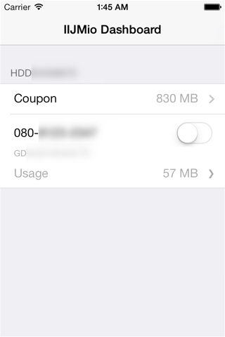
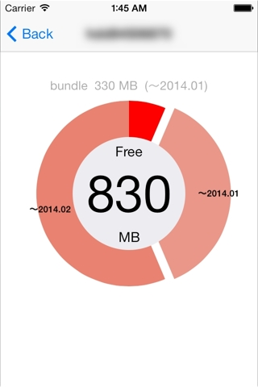
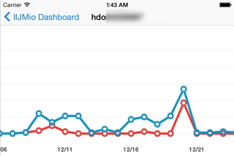

MioDashboard
============

IIJmioの[クーポンスイッチAPI](https://www.iijmio.jp/guide/outline/hdd/mioponapi.jsp)を利用したiOSサンプルアプリケーションです。

次のライブラリを利用しています。

* [ReactiveCocoa](https://github.com/ReactiveCocoa/ReactiveCocoa)
* [Underscore.m](http://underscorem.org/)
* [Mantle](https://github.com/MantleFramework/Mantle)
* [AFNetworking-RACExtensions](https://github.com/CodaFi/AFNetworking-RACExtensions)
* [libExtObjc](https://github.com/jspahrsummers/libextobjc)
* [TWMessagebarManager](https://github.com/terryworona/TWMessageBarManager)
* [VTAcknowledgementsViewController](https://github.com/vtourraine/VTAcknowledgementsViewController)
* [XYPieChart](https://github.com/xyfeng/XYPieChart)
* [iOSPlot](https://github.com/honcheng/iOSPlot)

Screenshots
===========

How to Use
==========

あらかじめ、[IIJmioクーポンスイッチAPI](https://api.iijmio.jp/mobile/d/)のディベロッパIDを取得する必要があります。

ディベロッパIDを取得後に、MioRestHelper.mにデベロッパIDとリダイレクトURIを設定の上、コンパイルしてください。

            instance.clientID = @"取得したデベロッパID";
            instance.redirectURI = @"リダイレクトURI";

Reference
=========

* [ネットワーク周りのシグナル処理について](http://safx-dev.blogspot.jp/2014/01/iijmioios.html)
* [OAuth周りのシグナル処理について](http://safx-dev.blogspot.jp/2014/01/iijmioiosoauth.html)
* [利用したライブラリについて](http://safx-dev.blogspot.jp/2014/01/iijmioapiios.html)
* [ReactiveCocoaでのフロー制御の例 (Speaker Deck)](https://speakerdeck.com/matuyuji/reactivecocoadefalsehurozhi-yu-falseli)

License
=======

MIT
